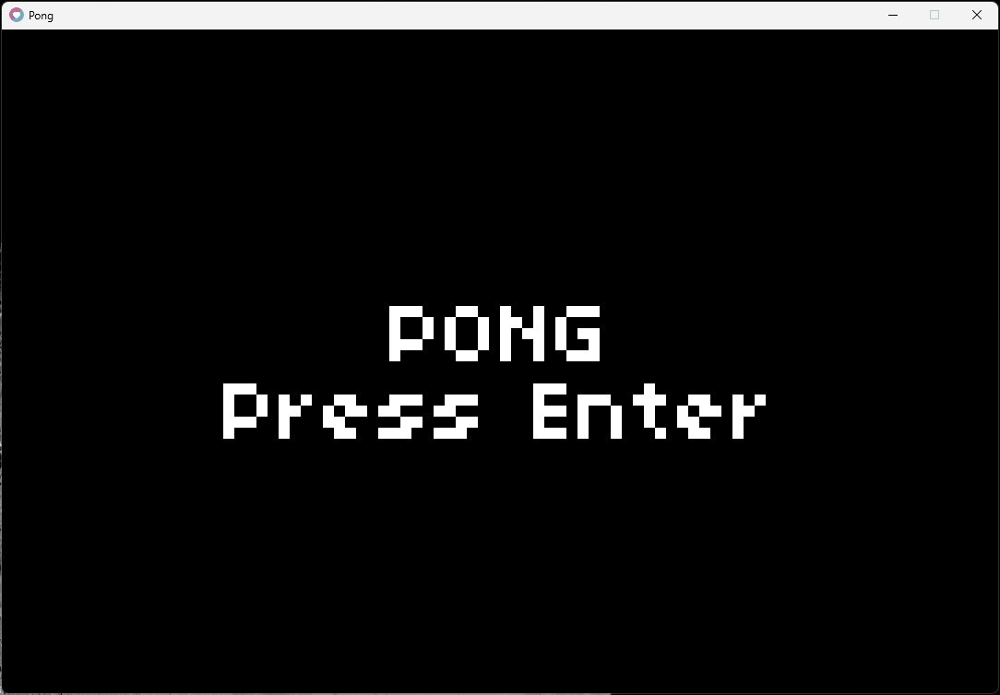

# Pong

Minimal [LÖVE](https://www.love2d.org) project for learning.

This game is based on [Lecture 0](https://www.youtube.com/watch?v=MY2y3dDwgMk)
from CS50's Introduction to 2D Game Development.

## Purpose of this project

- Learn [Lua](https://www.lua.org) and the [LÖVE](https://www.love2d.org)
  framework by building a complete game from scratch.
- Explore Lua OOP and compare its style and tradeoffs with object-oriented
  patterns from other languages.
- Try Lua type annotations and document the code with
  [LuaLS annotations](https://luals.github.io/wiki/annotations/).
- Practice designing a clean game architecture, even when the project is small
  enough that a simpler structure would be sufficient.
- Experiment with AI-assisted game development as part of the workflow.

## Architecture Map

- `main.lua`
  - LÖVE entry point
  - forwards callbacks to `Game`
  - keeps the bootstrap layer thin
- `src/core/game.lua`
  - composition root
  - creates fonts, viewport, debug overlay, shared context, and states
  - owns top-level draw flow and state dispatch
  - does not contain gameplay rules
- `src/core/context.lua`
  - shared dependency bundle
  - carries viewport size, config tables, palette, text, and fonts
  - reduces constructor noise without hiding where dependencies come from
- `src/core/viewport.lua`
  - virtual resolution and scaling helper
  - handles render-space to screen-space conversion
  - isolates the render-window concern
- `src/core/debug.lua`
  - debug overlay rendering
  - FPS and grid
  - reads palette and viewport info from shared context
- `src/core/state_manager.lua`
  - state registration and switching
  - provides lifecycle dispatch
  - keeps state transitions centralized
- `src/states/start.lua`
  - title screen
  - start input handling
  - no gameplay logic
- `src/states/play.lua`
  - gameplay state orchestration
  - delegates match logic to `Match`
  - handles pause and game-over transitions
- `src/states/pause.lua`
  - pause screen
  - pause input handling
  - no gameplay mutation
- `src/states/game_over.lua`
  - end screen
  - displays winner message
  - restart input handling
- `src/gameplay/match.lua`
  - Pong match controller
  - owns ball, players, round reset, scoring, and win detection
  - orchestrates systems and entities
- `src/entities/ball.lua`
  - ball data and movement
  - reset/update/draw behavior
- `src/entities/player.lua`
  - paddle data and movement
  - score storage
  - draw behavior
- `src/systems/input.lua`
  - keyboard mapping and player movement input
  - keeps controls separate from match rules
- `src/systems/collision.lua`
  - collision predicates only
  - no state mutation, just checks
- `src/systems/scoring.lua`
  - score increment and winner messaging
  - keeps scoring rules separate from rendering
- `src/config/display.lua`
  - virtual viewport size
- `src/config/gameplay.lua`
  - ball, paddle, and win tuning values
- `src/config/controls.lua`
  - key bindings
- `src/config/palette.lua`
  - centralized colors
- `src/config/text.lua`
  - centralized UI strings
- `src/config/ui.lua`
  - font sizes and font path
- `src/config/debug.lua`
  - debug enable flag

The main dependency flow is:

- `main.lua` -> `Game`
- `Game` -> `Viewport`, `Debug`, `StateManager`, states, config, `Context`
- `Start` / `Play` / `Pause` / `GameOver` -> `Context`
- `PlayState` -> `Match`
- `Match` -> `Ball`, `Player`, `Input`, `Collision`, `Scoring`

## How to play

The game uses a simple state flow:

- `start` screen
- `play`
- `pause`
- `game over`

Goal:

- score 9 points before your opponent

Controls:

- `Enter` - start the match from the title screen
- `D` - move player 1 up
- `S` - move player 1 down
- `K` - move player 2 up
- `J` - move player 2 down
- `Space` - pause during play
- `Space` - resume from pause
- `Enter` - return to the start screen from game over
- `Escape` - quit the game

Rules:

- the ball bounces off the top and bottom edges
- the ball bounces off paddles and speeds up slightly after each hit
- when the ball leaves the left side, player 2 scores
- when the ball leaves the right side, player 1 scores
- the first player to reach 9 points wins

## Make targets

Available targets:

- `make init` - fetch all local dependencies
- `make update` - re-fetch all local dependencies
- `make clean` - remove all local cached dependencies
- `make run` - start the game with [LÖVE](https://www.love2d.org), requires
  `love` to be on your [PATH](https://www.love2d.org/wiki/Getting_Started)
